# NTUT Computer Organization — HW5 Verilog

國立臺北科技大學 計算機組織 第五次作業 — Verilog 基礎設計

---

## 📋 作業內容

### Lab 1 — Divide by 2 Counter（除二計數器）


使用 Verilog 實作一個「除以 2」的時脈分頻器。

| Port | Direction | Description |
|------|-----------|-------------|
| `clk_in` | input | 輸入時脈 |
| `reset` | input | 同步重置（高電位有效） |
| `enable` | input | 致能控制 |
| `clk_out` | output | 輸出時脈（頻率 = clk_in / 2） |

**運作原理：** 每次 `clk_in` 正緣觸發時，若 `reset=1` 則輸出清零；若 `enable=1` 則將 `clk_out` 取反，達到除頻效果。

📁 實作位置：[`Lab1_clk_div/clk_div.v`](Lab1_clk_div/clk_div.v)  
🧪 測試台：[`Lab1_clk_div/clk_div_tb.v`](Lab1_clk_div/clk_div_tb.v)

#### 🖥️ 模擬結果（ModelSim）

| ModelSim 模擬環境 | 波形圖（全覽） |
|:---:|:---:|
| 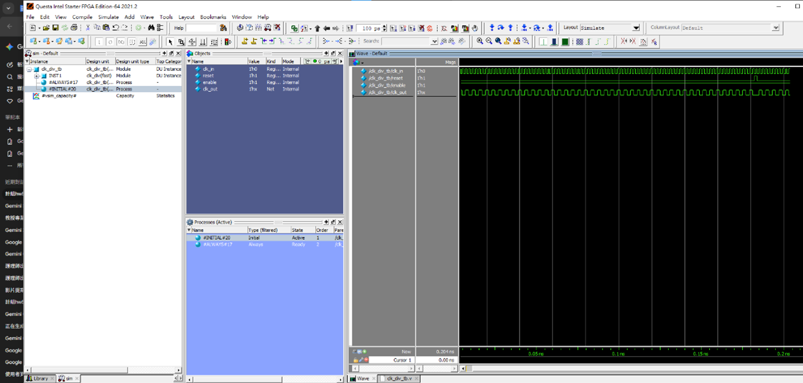 | 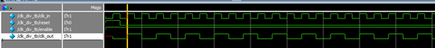 |

**波形圖（放大）：** `reset` 高電位期間 `clk_out` 維持 0，放開後每個正緣切換一次，輸出頻率為輸入的一半。

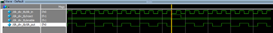

---

### Lab 2 — Clock Divide by 3（除三分頻器）


以 Verilog 實作一個「除以 3」的時脈分頻器。

| Port | Type | Description |
|------|------|-------------|
| `clk` | input | 輸入時脈（50 MHz） |
| `reset` | input | 同步重置（高電位有效） |
| `clk_out` | output | 輸出時脈（16.67 MHz） |

**運作原理：** 利用雙計數器（正/負緣各一個）分別計數 0 → 1 → 2，當任一計數器達到 2 時，輸出為高電位，達成 1:3 分頻效果。

📁 實作位置：[`Lab2_ClockBy3/ClockBy3.v`](Lab2_ClockBy3/ClockBy3.v)  
🧪 測試台：[`Lab2_ClockBy3/clkdiv3_tb.v`](Lab2_ClockBy3/clkdiv3_tb.v)

#### 🖥️ 模擬結果（ModelSim）

| ModelSim 模擬環境 | 波形圖（全覽） |
|:---:|:---:|
| 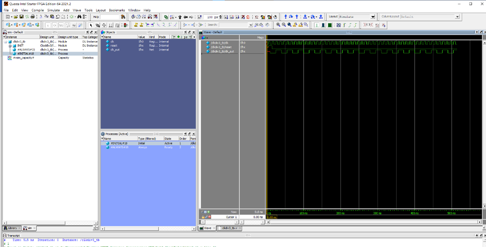 | 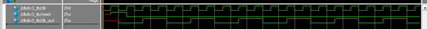 |

**波形標記（紅箭頭標示每個輸出脈衝）：** 可觀察到每 3 個輸入週期 `clk_out` 輸出一次高電位。

| 紅箭頭標記波形 | 波形（放大） |
|:---:|:---:|
| 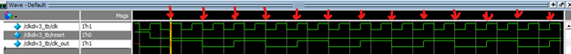 | 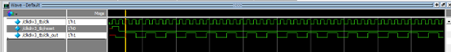 |

---

### Homework 1 — 4-bit Full Adder（四位元全加器）


使用 Behavioral Modeling 實作 4-bit Full Adder。

**規格說明：**

- **輸入：** 4-bit 被加數 (A)、4-bit 加數 (B)、進位輸入 (Cin)
- **輸出：** 4-bit 和 (S)、進位輸出 (C4)
- **實作方法：** 直接利用 Verilog 的加法運算，自動產生進位

| Port | Width | Description |
|------|-------|-------------|
| `A[3:0]` | 4-bit | 被加數 |
| `B[3:0]` | 4-bit | 加數 |
| `Cin` | 1-bit | 最低位進位輸入 |
| `S[3:0]` | 4-bit | 和（Sum） |
| `C4` | 1-bit | 最高位進位輸出 |

**運作原理：** 將進位輸出與 4-bit 和結合成 5-bit 結果 `{C4, S} = A + B + Cin`，實現簡潔高效的加法邏輯。

📁 實作位置：[`HW1_FullAdder4bit/FullAdder4bit.v`](HW1_FullAdder4bit/FullAdder4bit.v)  
🧪 測試台：[`HW1_FullAdder4bit/FullAdder4bit_tb.v`](HW1_FullAdder4bit/FullAdder4bit_tb.v)

#### 🖥️ 模擬結果（ModelSim）

| ModelSim 模擬環境 | 波形圖（全覽） |
|:---:|:---:|
| 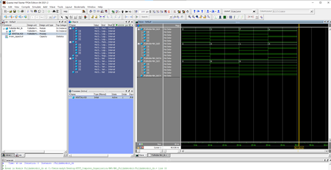 | 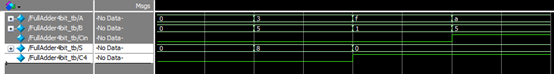 |

**驗證測試案例：**

| 測試案例 | A | B | Cin | S（Sum） | C4（Carry） |
|---------|---|---|-----|---------|------------|
| Case 0 | `0000` | `0000` | `0` | `0000` | `0` |
| Case 1 | `0011` (3) | `0101` (5) | `0` | `1000` (8) | `0` |
| Case 2 | `1111` (15) | `0001` (1) | `0` | `0000` (0) | `1` |
| Case 3 | `1010` (10) | `0101` (5) | `1` | `0000` (0) | `1` |

| 詳細波形 | 數值標示波形 |
|:---:|:---:|
| 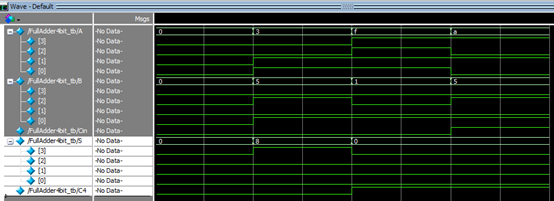 | 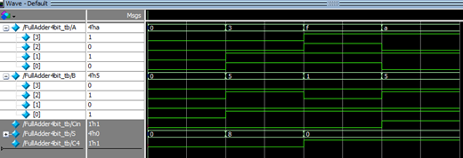 |

---

## 🗂️ 專案結構

```
HW5/
├── Lab1_clk_div/         # Lab1 Divide by 2 Counter
│   ├── clk_div.v         # 主要設計
│   └── clk_div_tb.v      # 測試台
├── Lab2_ClockBy3/        # Lab2 Divide by 3 Counter
│   ├── ClockBy3.v        # 主要設計
│   └── clkdiv3_tb.v      # 測試台
├── HW1_FullAdder4bit/    # HW1 4-bit Full Adder
│   ├── FullAdder4bit.v   # 主要設計
│   └── FullAdder4bit_tb.v # 測試台
├── imgs/                 # 作業說明截圖與模擬結果
│   ├── Lab1.png
│   ├── Lab1/             # Lab1 模擬截圖
│   │   ├── Lab1_1.png
│   │   ├── Lab1_2.png
│   │   └── Lab1_3.png
│   ├── Lab2.png
│   ├── Lab2/             # Lab2 模擬截圖
│   │   ├── Lab2_1.png
│   │   ├── Lab2_2.png
│   │   ├── Lab2_3.png
│   │   └── Lab2_4.png
│   ├── Homework1.png
│   └── Homework1/        # HW1 模擬截圖
│       ├── Homework1_1.png
│       ├── Homework1_2.png
│       ├── Homework1_3.png
│       └── Homework1_4.png
└── README.md
```

## 🛠️ 開發環境

- **EDA Tool：** Intel Quartus Prime
- **模擬工具：** ModelSim
- **語言：** Verilog HDL
