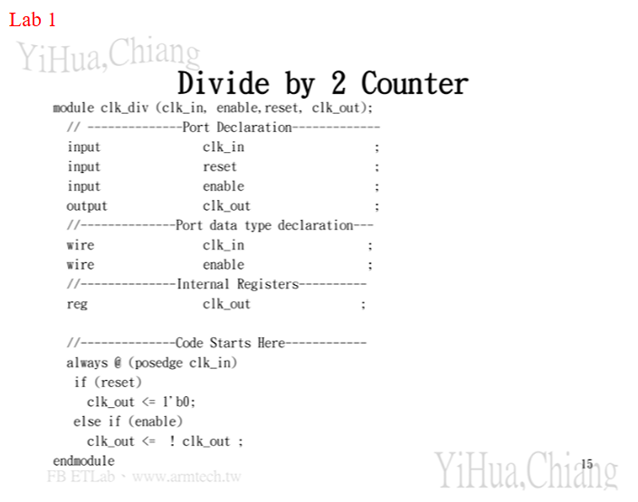
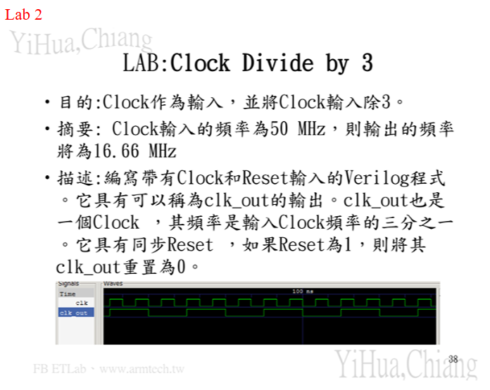
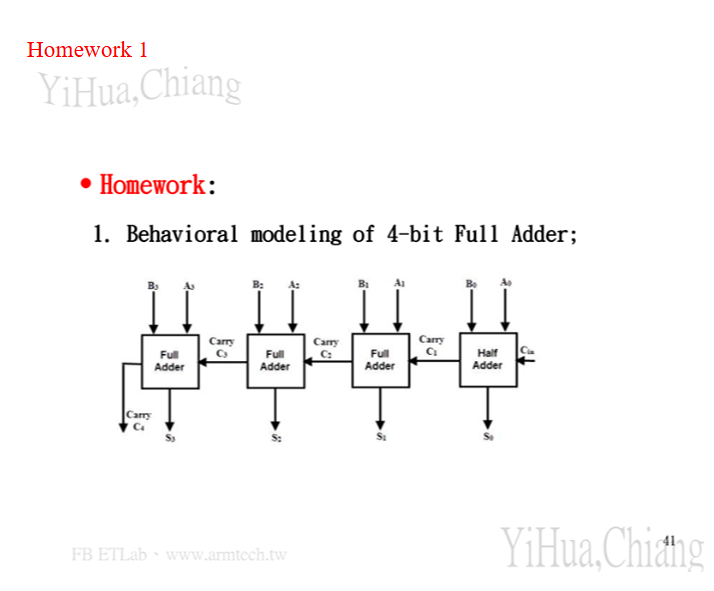

# NTUT Computer Organization — HW5 Verilog

國立臺北科技大學 計算機組織 第五次作業 — Verilog 基礎設計

---

## 📋 作業內容

### Lab 1 — Divide by 2 Counter（除二計數器）



使用 Verilog 實作一個「除以 2」的時脈分頻器。

| Port | Direction | Description |
|------|-----------|-------------|
| `clk_in` | input | 輸入時脈 |
| `reset` | input | 同步重置（高電位有效） |
| `enable` | input | 致能控制 |
| `clk_out` | output | 輸出時脈（頻率 = clk_in / 2） |

**運作原理：** 每次 `clk_in` 正緣觸發時，若 `reset=1` 則輸出清零；若 `enable=1` 則將 `clk_out` 取反，達到除頻效果。

📁 實作位置：[`Lab1_clk_div/clk_div.v`](Lab1_clk_div/clk_div.v)  
🧪 測試台：[`Lab1_clk_div/clk_div_tb.v`](Lab1_clk_div/clk_div_tb.v)

---

### Lab 2 — Clock Divide by 3（除三分頻器）



以 Verilog 實作一個「除以 3」的時脈分頻器。

| Port | Type | Description |
|------|------|-------------|
| `clk` | input | 輸入時脈（50 MHz） |
| `reset` | input | 同步重置（高電位有效） |
| `clk_out` | output | 輸出時脈（16.67 MHz） |

**運作原理：** 利用雙計數器（正/負緣各一個）分別計數 0 → 1 → 2，當任一計數器達到 2 時，輸出為高電位，達成 1:3 分頻效果。

📁 實作位置：[`Lab2_ClockBy3/ClockBy3.v`](Lab2_ClockBy3/ClockBy3.v)  
🧪 測試台：[`Lab2_ClockBy3/clkdiv3_tb.v`](Lab2_ClockBy3/clkdiv3_tb.v)

---

### Homework 1 — 4-bit Full Adder（四位元全加器）



使用 Behavioral Modeling 實作 4-bit Full Adder。

**架構說明：**

- 最低位元（bit 0）使用 **Half Adder**，Carry-in 固定為 0
- 高位元（bit 1 ~ 3）各使用一個 **Full Adder**，接收前一級的進位輸出
- 最高位 Full Adder 的 Carry-out 即為整體進位輸出（C₄）

| Port | Width | Description |
|------|-------|-------------|
| `A[3:0]` | 4-bit | 被加數 |
| `B[3:0]` | 4-bit | 加數 |
| `Cin` | 1-bit | 最低位進位輸入 |
| `S[3:0]` | 4-bit | 和（Sum） |
| `Cout` | 1-bit | 最高位進位輸出 |

---

## 🗂️ 專案結構

```
HW5/
├── Lab1_clk_div/         # Lab1 Divide by 2 Counter
│   ├── clk_div.v         # 主要設計
│   └── clk_div_tb.v      # 測試台
├── Lab2_ClockBy3/        # Lab2 Divide by 3 Counter
│   ├── ClockBy3.v        # 主要設計
│   └── clkdiv3_tb.v      # 測試台
├── imgs/                 # 作業說明截圖
│   ├── Lab1.png
│   ├── Lab2.png
│   └── Homework1.png
└── README.md
```

## 🛠️ 開發環境

- **EDA Tool：** Intel Quartus Prime
- **模擬工具：** ModelSim
- **語言：** Verilog HDL
